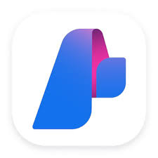

## Namaste, I am Arshita Shukla 👋

**Embedded Systems** | **Hardware-Software Co-design** | **Platform Management** | **System on Chip** | **Baremetal Programming** | **Cloud** | **Open-source** | **Gen AI**

---

- 👩‍💻 Firmware Engineer at Microsoft
- 🎓 Completed my undergrad in Electronics & Communication Engineering from NIT Surat, Gujarat (2022)
- 🛰️ NavIC (ISRO) enthusiast — my undergrad thesis focused on application of satellite communication and is also published!([IEEE Xplore link](https://ieeexplore.ieee.org/document/9848361))
- 🇫🇷 Former Research Intern at Inria, France
- 🏸 When I’m not debating hardware vs software performance, you’ll find me geeking out over sports (especially badminton)
- ⌨️ Fun fact GitHub wanted me to share: Always on a mission to improve my typing speed — currently at 52 WPM with 98% accuracy
- 😅 Sin I’ve committed before: Directly merging to `main` branch

## GitHub Stats

## Tools I use

  
  
  
  
  
  
  
  
  
  
  
  
  
  

## Badges

## Connect

1. Mail: arshitashukla.27@gmail.com
2. Linkedin: https://www.linkedin.com/in/arshita-shukla-b656821ab/
3. Discord: arshita_10188
4. Zulip: https://rust-lang.zulipchat.com/#user/895436
