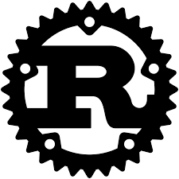
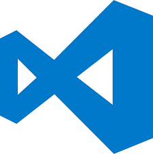
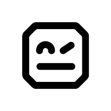

## Namaste, I am Arshita Shukla 👋

**Embedded Systems** | **Hardware-Software Co-design** | **Platform Management** | **System on Chip** | **Baremetal Programming** | **Cloud** | **Open-source** | **Gen AI**

---

- 👩‍💻 Firmware Engineer at Microsoft, building firmware and system software for cloud-scale hardware platforms.
- 🤖 AI systems enthusiast, fascinated by AI accelerators, cloud infrastructure, distributed training, and inference systems. I enjoy following the latest research and industry developments shaping the future of AI.
- 📚 Outside of work, I spend a lot of my time reading AI research papers, systems blogs and technical deep dives on large-scale AI training and inference
- 🎓 Completed my undergrad in Electronics & Communication Engineering from NIT Surat, Gujarat (2022)
- 🛰️ My undergrad thesis focused on application of satellite communication and is also published!([IEEE Xplore link](https://ieeexplore.ieee.org/document/9848361))
- 🇫🇷 Former Research Intern at Inria, France
- 🏸 When I’m not debating hardware vs software performance, you’ll find me geeking out over sports (especially badminton)

## GitHub Stats

## Tools I use

  
  
  
  
  
  
  
  
  
  
  
  
  
  

## Badges

## Connect

1. Mail: arshitashukla.27@gmail.com
2. Linkedin: https://www.linkedin.com/in/arshita-shukla-b656821ab/
3. Discord: arshita_10188
4. Zulip: https://rust-lang.zulipchat.com/#user/895436
